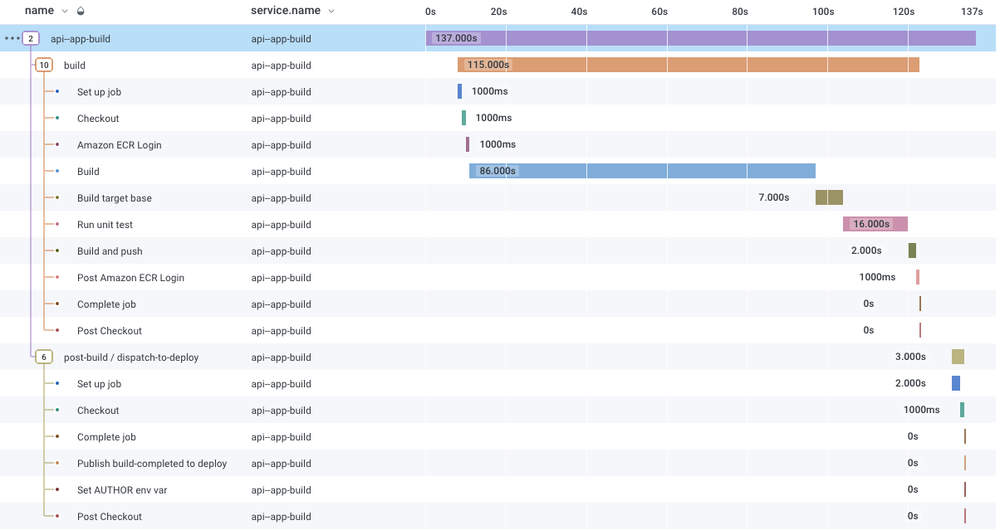

[](https://docs.stepsecurity.io/actions/stepsecurity-maintained-actions)

# Open Telemetry CI/CD Action

[![Unit Tests][ci-img]][ci]
![GitHub License][license-img]

This action exports Github CI/CD workflows to any endpoint compatible with OpenTelemetry.

This is a fork of [otel-export-trace-action](https://github.com/inception-health/otel-export-trace-action) with more features and better support.

Compliant with OpenTelemetry [CICD semconv](https://opentelemetry.io/docs/specs/semconv/attributes-registry/cicd/).
Look at [Sample OpenTelemetry Output](./src/__assets__/output_success.txt) for the list of attributes and their values.



## Usage

We provide sample code for popular platforms. If you feel one is missing, please open an issue.

| Code Sample                 | File                                             |
| --------------------------- | ------------------------------------------------ |
| Inside an existing workflow | [build.yml](.github/workflows/build.yml)         |
| From a private repository   | [private.yml](.github/workflows/private.yml)     |
| Axiom                       | [axiom.yml](.github/workflows/axiom.yml)         |
| New Relic                   | [newrelic.yml](.github/workflows/newrelic.yml)   |
| Honeycomb                   | [honeycomb.yml](.github/workflows/honeycomb.yml) |
| Dash0                       | [dash0.yml](.github/workflows/dash0.yml)         |

### On workflow_run event

[workflow_run github documentation](<https://docs.github.com/en/actions/writing-workflows/choosing-when-your-workflow-runs/events-that-trigger-workflows#workflow_run>)

```yaml
on:
  workflow_run:
    workflows:
      # The name of the workflow(s) that triggers the export
      - "Build"
    types: [completed]

jobs:
  otel-cicd-actions:
    runs-on: ubuntu-latest
    steps:
      - uses: step-security/otel-cicd-action@v4
        with:
          otlpEndpoint: grpc://api.honeycomb.io:443/
          otlpHeaders: ${{ secrets.OTLP_HEADERS }}
          githubToken: ${{ secrets.GITHUB_TOKEN }}
          runId: ${{ github.event.workflow_run.id }}
```

### Inside an existing workflow

```yaml
jobs:
  build:
    # ... existing code
  otel-cicd-action:
    if: always()
    name: OpenTelemetry Export Trace
    runs-on: ubuntu-latest
    needs: [build] # must run when all jobs are completed
    steps:
      - name: Export workflow
        uses: step-security/otel-cicd-action@v4
        with:
          otlpEndpoint: grpc://api.honeycomb.io:443/
          otlpHeaders: ${{ secrets.OTLP_HEADERS }}
          githubToken: ${{ secrets.GITHUB_TOKEN }}
```

### `On workflow_run event` vs `Inside an existing workflow`

Both methods must be run when the workflow is completed, otherwise, the trace will be incomplete.

| Differences                                         | On workflow_run event | Inside an existing workflow |
| --------------------------------------------------- | --------------------- | --------------------------- |
| Shows in PR page                                    | No                    | Yes                         |
| Shows in Actions tab                                | Yes                   | Yes                         |
| Needs extra consideration to be run as the last job | No                    | Yes                         |
| Must be duplicated for multiple workflows           | No                    | Yes                         |

### Private Repository

If you are using a private repository, you need to set the following permissions in your workflow file.
It can be done at the global level or at the job level.

```yaml
permissions:
  contents: read # Required. To access the private repository
  actions: read # Required. To read workflow runs
  pull-requests: read # Optional. To read PR labels
  checks: read # Optional. To read run annotations
```

### Adding arbitrary resource attributes

You can use `extraAttributes` to set any additional string resource attributes.
Attributes are splitted on `,` and then each key/value are splitted on the first `=`.

```yaml
- name: Export workflow
  uses: step-security/otel-cicd-action@v4
  with:
    otlpEndpoint: "CHANGE ME"
    otlpHeaders: "CHANGE ME"
    githubToken: ${{ secrets.GITHUB_TOKEN }}
    extraAttributes: "extra.attribute=1,key2=value2"
```

### Action Inputs

| name            | description                                                                                                 | required | default                               | example                                                          |
| --------------- | ----------------------------------------------------------------------------------------------------------- | -------- | ------------------------------------- | ---------------------------------------------------------------- |
| otlpEndpoint    | The destination endpoint to export OpenTelemetry traces to. It supports `https://`, `http://` and `grpc://` endpoints. | true     |                                       | `https://api.axiom.co/v1/traces`                                 |
| otlpHeaders     | Headers to add to the OpenTelemetry exporter .                                                              | true     |                                       | `x-honeycomb-team=YOUR_API_KEY,x-honeycomb-dataset=YOUR_DATASET` |
| otelServiceName | OpenTelemetry service name                                                                                  | false    | `<The name of the exported workflow>` | `Build CI`                                                       |
| githubToken     | The repository token with Workflow permissions. Required for private repos                                  | false    |                                       | `${{ secrets.GITHUB_TOKEN }}`                                    |
| runId           | Workflow Run ID to Export                                                                                   | false    | env.GITHUB_RUN_ID                     | `${{ github.event.workflow_run.id }}`                            |
| extraAttributes | Extra resource attributes to add to each span | false |  | extra.attribute=1,key2=value2 |

### Action Outputs

| name    | description                                 |
| ------- | ------------------------------------------- |
| traceId | The OpenTelemetry Trace ID of the root span |

[ci-img]: https://github.com/step-security/otel-cicd-action/actions/workflows/build.yml/badge.svg?branch=main
[ci]: https://github.com/step-security/otel-cicd-action/actions/workflows/build.yml?query=branch%3Amain
[license-img]: https://img.shields.io/github/license/step-security/otel-cicd-action
